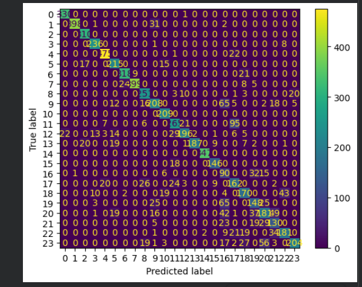

# SCT_ML_4

# Hand Gesture Recognition using Support Vector Machine (SVM)

## 📌 Project Overview

This project focuses on recognizing and classifying hand gestures using the Sign Language MNIST dataset. A Support Vector Machine (SVM) model was trained on image-based gesture data to accurately identify different hand signs.

The project demonstrates the complete machine learning workflow including data preprocessing, model training, evaluation, and visualization.

---

## 🎯 Objective

To build a machine learning model capable of recognizing and classifying hand gestures from image data.

---

## 📂 Dataset

Dataset: Sign Language MNIST

The dataset contains grayscale images representing different hand gestures used in sign language.

---

## 🛠 Technologies Used

- Python
- Pandas
- NumPy
- Matplotlib
- Scikit-Learn
- Google Colab

---

## 📊 Data Preprocessing

- Loaded training and testing datasets
- Separated features and labels
- Normalized pixel values
- Prepared data for machine learning training

---

## 🤖 Machine Learning Algorithm

### Support Vector Machine (SVM)

SVM is a supervised machine learning algorithm used for classification tasks. It identifies optimal decision boundaries between multiple gesture classes.

---

## 📈 Model Evaluation

### Results

- Accuracy: **80.26%**

The model successfully learned gesture patterns and achieved strong classification performance on unseen test data.

---

## 📷 Visualizations

- Confusion Matrix
- Hand Gesture Prediction Outputs

These visualizations help evaluate model performance and prediction quality.

---

## 🚀 Outcome

Successfully developed a Hand Gesture Recognition system using Support Vector Machine (SVM) and gained practical experience in image classification and computer vision.

This project was completed as part of my Machine Learning Internship at SkillCraft Technology.

---

# 📸 Project Screenshots

## Confusion Matrix

## Gesture Predictions

